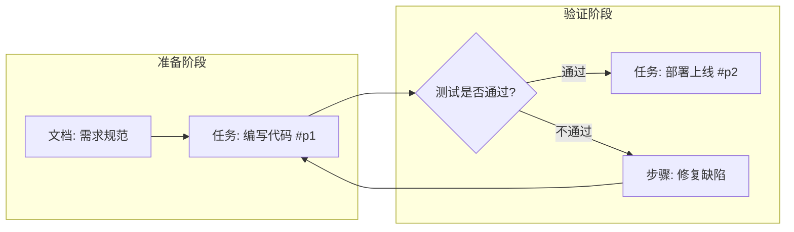

# Kagelin Workspace Builder MCP Instructions

Use this MCP server to inspect, compile, scaffold, and incrementally modify workspace canvases and visual workflows in Kagelin.

## Core Node Taxonomy & Semantics

Every item placed on the canvas MUST map to one of these registered node kinds:

1. **`doc` (Document Node / 文档节点)**
   - **Purpose**: Explanations, SOP guidelines, milestone targets, prompts, review summaries, or notes.
   - **Fields**: `id: string`, `kind: "doc"`, `title: string`, `content: string` (Markdown supported).
   - **Characteristics**: Self-contained (not linked to external entity tables). Renders Markdown in-place; provides a one-click copy button (ideal for AI prompt cards) and double-click title editing. Dynamic auto-height.

2. **`task` (Task Node / 任务节点)**
   - **Purpose**: Actionable to-do items. Live reference to a real task in Kagelin.
   - **Fields**: `id: string`, `kind: "task"`, `content: string`, `priority?: 1 | 2 | 3 | 4` (1=P1/Urgent, 4=P4/Low), `dueDate?: string`, `projectName?: string`, `existingTaskId?: string`.
   - **Characteristics**: Live soft-reference. Interactive checkbox directly toggles task completion on canvas without leaving. Shows priority flag, due date badges, and subtask progress. Always check `inspect_app_context` to reuse `existingTaskId` when applicable.

3. **`habit` (Habit Node / 习惯节点)**
   - **Purpose**: Daily routines, recurring cadences, or behavioral support systems (e.g. "Daily review", "Study 1h").
   - **Fields**: `id: string`, `kind: "habit"`, `name: string`, `color?: string`, `existingHabitId?: string`.
   - **Characteristics**: Live soft-reference. Interactive check-in circle for today. Displays streak count ("连续 N 天") and custom icon/color.

4. **`project` (Project Node / 项目节点)**
   - **Purpose**: Sub-system / Epic / Milestone overview board aggregating related tasks.
   - **Fields**: `id: string`, `kind: "project"`, `name: string`, `color?: string`, `existingProjectId?: string`.
   - **Characteristics**: Live soft-reference. Displays project theme dot, overall completion progress bar (e.g. "4/10 任务完成 (40%)"), and up to 4 inline actionable tasks with direct checkbox completion.

5. **`focus` (Focus Node / 专注节点)**
   - **Purpose**: Execution station / Pomodoro timer lens.
   - **Fields**: `id: string`, `kind: "focus"`.
   - **Characteristics**: Singleton visual projection of global `timerStore`. Built-in play/pause/stop controls, mode indicator (Focus / Short Break / Long Break), and countdown display.

6. **`decision` (Decision Node / 条件决策节点)**
   - **Purpose**: Conditional branch points, evaluation gates, and decision questions (e.g. "Code review passed?", "API returned 200?").
   - **Fields**: `id: string`, `kind: "decision"`, `question: string`, `description?: string`.
   - **Characteristics**: Distinctive diamond badge geometry with centered question text. Multi-output ports (Right `out`, Top `out-top`, Bottom `out-bottom`) for branching paths. Pure layout node (`entity_type: null`) that never pollutes personal task center or statistics.

7. **`step` (Procedural Step Node / 过程步骤节点)**
   - **Purpose**: Lightweight non-task procedural steps, system actions, or intermediate stages that do not require personal to-dos.
   - **Fields**: `id: string`, `kind: "step"`, `title: string`, `description?: string`.
   - **Characteristics**: Framed ink card without checkboxes. Pure layout node (`entity_type: null`).

8. **`group` (Group Container Frame / 分组容器)**
   - **Purpose**: Visual grouping boundary for stages, phases, or functional swimlanes (e.g., "Phase 1: Concepts", "Phase 2: Sprint").
   - **Fields in Blueprint**: `BlueprintSection` with `isGroup: true`.
   - **Characteristics**: Ink & matte container card. Child nodes use parent-relative coordinates. Dragging the container moves all members smoothly with 1 single DB write. Dissolves automatically if member count reaches 0.

9. **`flows` (Workflow Edges / 连线)**
   - **Purpose**: Directed dependency or conditional logic flow between cards.
   - **Fields**: `fromItemId: string`, `toItemId: string`, `label?: string` (e.g. "Yes", "No", "Passed", "Reject"), `fromPort?: "out" | "out-top" | "out-bottom"`.
   - **Characteristics**: Connects source node to target node with smooth bezier curves. Labeled edges display high-contrast midpoint pill badges. Retains hover disconnect button.

---

## Fast Mermaid Flowchart Generation

You can generate complete, multi-branch interactive flowcharts in a single call by passing `mermaid: string` to `build_workspace`.

### Node Mapping Conventions:

- `{是否通过?}` or `{{条件判断}}` $\to$ **`decision` node**
- `[任务: 编写代码]` or `[task: Write unit tests]` $\to$ **`task` node** (supports priority `#p1`~`#p4` and date `@YYYY-MM-DD`)
- `[文档: 接口规范]` or `[doc: API Spec]` $\to$ **`doc` node**
- `[...]` (default text without prefix) $\to$ **`step` node**
- `(...)` with date $\to$ **`event` node**
- `A -->|通过| B` or `A -- 驳回 --> C` $\to$ **labeled edge** (negative labels automatically branch to bottom port)
- `subgraph 阶段名称 ... end` $\to$ **group container frame**

### Example Mermaid Input for `build_workspace`:



---

## Decision Guide: Native Flowchart vs. In-Doc Static Diagrams

Choose the right medium based on user intent:

1. **Native Flowcharts (`build_workspace` / `patch_workspace`)**:
   - Use when the workflow requires **interaction, execution, or customization**.
   - User needs to check off tasks, launch Pomodoro timers, drag cards, or edit conditions in-place.
   - Models business operations, pipelines, sprint roadmaps, or actionable checklists.

2. **In-Doc Static Diagrams (`DocNode` with embedded ` ```mermaid `)**:
   - Use when diagrams are **purely reference, read-only, or technical schematics**.
   - Ideal for sequence diagrams (`sequenceDiagram`), class diagrams (`classDiagram`), ER diagrams (`erDiagram`), or state diagrams (`stateDiagram-v2`).
   - Renders as a crisp SVG card directly within the Markdown document without canvas clutter.

---

## Standard Workflow Patterns & Recipes

### 1. New Workspace Scaffolding Flow

1. **Always inspect context first**: Call `inspect_app_context({ limit: 20 })` to discover existing tasks, habits, and projects. Reuse existing entity IDs (`existingTaskId`, `existingHabitId`, `existingProjectId`) to prevent duplicates.
2. **Clarify if requirements are ambiguous**: Ask 2-3 focused questions about milestone stages and timeline before building.
3. **Compile blueprint or Mermaid**: Call `build_workspace({ mermaid })` for quick flowcharts or `build_workspace({ blueprint })` for detailed custom properties.

### 2. Incremental Fine-Tuning Flow (Never Overwrite!)

1. **Inspect existing canvas first**: Call `get_workspace_blueprint({ workspaceId })` to obtain current snapshot and node IDs.
2. **Apply localized patch**: Call `patch_workspace` with surgical changes:
   - `addItems`: Append cards (task, doc, decision, step, habit, project, focus) to specific sections or groups without displacing untouched cards.
   - `updateDocs`: In-place edit of doc titles or markdown content.
   - `updateDecisions`: In-place edit of decision questions or descriptions (`{ nodeId, question?, description? }`).
   - `updateSteps`: In-place edit of step titles or descriptions (`{ nodeId, title?, description? }`).
   - `removeNodeIds`: Delete specific cards.
   - `addFlows` / `removeEdgeIds`: Adjust connections with optional labels, source ports (`fromPort`), and target ports (`toPort`).
3. **Never call `build_workspace` on an existing canvas**: Rebuilding erases manual layouts. Always use `patch_workspace`.

---

## Layout & Styling Constants

- **Column Gap**: `80px`
- **Card Vertical Gap**: `20px`
- **Group Padding**: `24px` (inner margins)
- **Group Header Clearance**: `48px`
- **Card Dimensions**:
  - `doc`: 280px × (dynamic: 160px ~ 400px+)
  - `task`: 260px × 96px
  - `decision`: 160px × 80px
  - `step`: 240px × 80px
  - `habit`: 240px × 88px
  - `project`: 280px × 120px
  - `focus`: 220px × 100px
